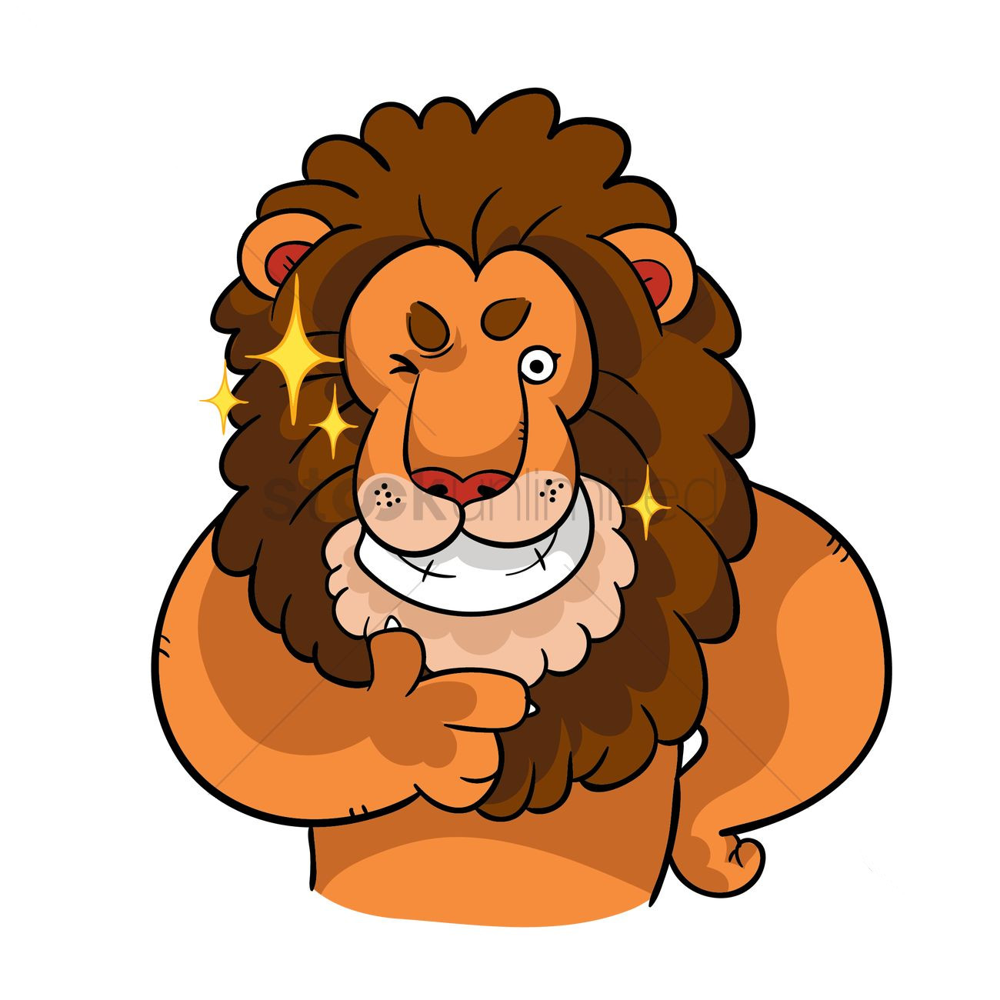
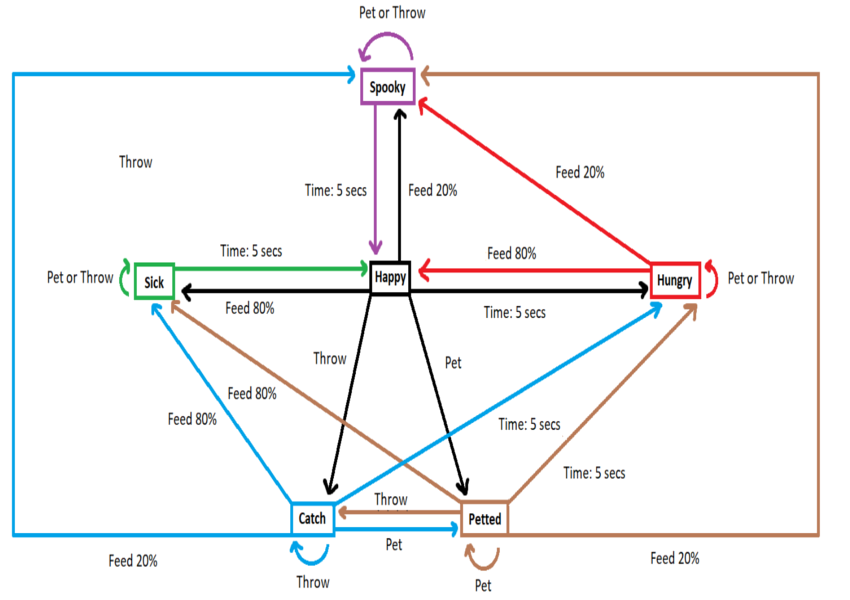

# Leo the Lion

A state machine project created in HTML. This was my first project in college.

## Backstory

Leo the Lion does not have a huge backstory. My last name means "Lion". His states are happy/full, sick, hungry, being pet, and ghost. They are pretty basic states except for ghost. Originally I had thought of killing the lion when I didn't feed it for a very long time. However, when my cousin was playing around with the demo I had created, he played with the elements in Google Chrome and changed the lion to a ghost lion. I thought I would be a terrible person if I simply let the lion die, so I added a state where Leo will try to "spook" the user randomly. Leo is an athletic lion, so he has the ability to catch a ball.

## Behavior

The webpage starts with Leo in his full and happy state. When he is in his happy state, he can go to 5 other states. If you feed him when he is full he will become sick. If you pet him, the image changes to him being pet. If you throw the ball, he will catch it. If you wait 5 seconds when he is full, being pet, or catching the ball, he will be hungry. When he is hungry, you can feed him to make him happy and full again. When he is hungry, he will not let you pet him and he will not let you play catch with him either. If you feed him when he is sick, it will say you need to stop over feeding him. When he is sick, he will not let you pet him and he will not let you play catch with him either. If you wait 5 seconds, he will go back to being happy and full. With the Math.random() method I added an if-then statement to the food function where if the random number is a certain number between 1 and 5, the lion will turn into a ghost to "spook" you. This has a 20% chance to occur. The other 80% of the time, you will feed him food. As a ghost, you cannot feed, pet, or throw the ball at him because your food, hand, or ball will go through him. If you wait 5 seconds he goes back to his happy and full state. In the pet state, you can feed, pet, and throw the ball at him. Petting him brings him back to the same state. In the catch state, you can still feed him and pet him. Throwing the ball will bring you back to the same state. Below, I have a state machine showing the relationship between the states and the stimuli I described here.

## State Machine

States: Happy, Sick, Hungry, Spooky, Petted, and Catch.

Stimuli: Feed, Pet, Throw, Random and Time.

